# Demo: Usando AWS DMS para alimentar un Data Lake en Near Real-Time

Este proyecto demuestra cómo implementar una arquitectura de Change Data Capture (CDC) para replicar datos desde un Amazon RDS (MySQL) hacia un Data Lake en Amazon S3, utilizando AWS DMS. El objetivo es liberar al desarrollador de la carga de programar lógica de auditoría y permitir analíticas en tiempo real.

> **IMPORTANTE:** Los procesos aplicados no contienen todas las medidas de seguridad necesarias con el fin de validar rápidamente la integración. Si desea aplicar esto en un entorno de producción, es mejor verificar las mejores prácticas y estándares de seguridad de datos y conexiones en AWS.

## Arquitectura
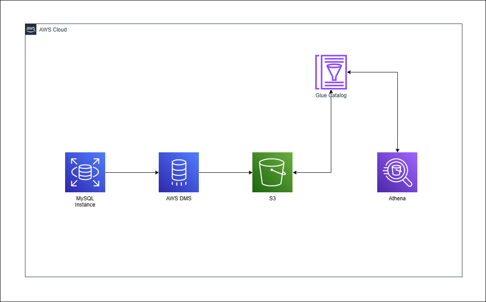

Los componentes para esta arquitectura son los siguientes:
- **Origen:** RDS MySQL como base de datos transaccional.
- **Motor:** AWS DMS en Replication Instance junto con Tasks y Endpoints.
- **Destino:** Amazon S3 para el data lake en formato Parquet.
- **Consulta:** Amazon Athena (SQL sobre S3).

## Desarrollo del Laboratorio

> Antes de seguir con el levantamiento del proyecto, es importante tener instalado [Terraform](https://developer.hashicorp.com/terraform/tutorials/aws-get-started/install-cli) y Python, así como tener [AWS CLI](https://docs.aws.amazon.com/cli/latest/userguide/getting-started-install.html) junto con tus [Access Keys ID y Secret Access Key](https://docs.aws.amazon.com/cli/latest/userguide/getting-started-quickstart.html) establecidos.

### Despliegue de la demo en tu entorno de AWS
1. Una vez se haya clonado el proyecto, dirígete a la carpeta `src/` e inicializa el entorno de Terraform:
```sh
cd src/

terraform init
```
2. Para verificar todos los servicios y cambios que se aplicarán en tu entorno de AWS, puedes aplicar los siguientes comandos:
```sh
terraform validate

terraform plan
```
3. Para desplegar tu proyecto, aplica el siguiente comando:
```sh
terraform apply
```
4. Cuando se aplique el comando, les solicitará ingresar una contraseña para tu base de datos en RDS. Después, les solicitará la confirmación para proceder con el despliegue. Escriben `yes`.

> **Nota:** El tiempo de ejecución para el despliegue será de un aproximado de 15 min a 17 min.

### Carga de datos a las base de datos en RDS
1. Antes de iniciar el proceso de DMS, es importante cargar información a la base de datos en RDS. Para ello, dirígete a la carpeta `src/scripts/` y crea un entorno virtual en Python:
```sh
cd src/scripts/

python3 -m venv env
```
2. Una vez estés dentro de la carpeta, activa el entorno virtual. Se mostrarán ambos comandos aplicados para diferentes sistemas operativos:
```sh
-- Windows
.\env\Scripts\Activate

-- Linux/MacOS
/env/bin/activate
```
3. Después de estar en el entorno, instala el siguiente paquete:
```sh
pip install pandas mysql-connector-python
```
4. Una vez el paquete se haya instalado, ejecuta el archivo `main.py`:
```sh
python3 main.py
```
5. Dentro de ello, se mostrará un listado de opciones para llenar la información. Selecciona la primera opción que tiene el valor `1`. Una vez realizado, se cargarán 1000 registros a la base de datos.

### Validación del proceso en DMS
1. En AWS, busca el servicio de DMS. Ingresa al servicio y deberías ver, en la sección Tasks, la tarea `rds-to-s3-cdc-demo`.
2. Inicia la tarea `rds-to-s3-cdc-demo` seleccionando la opción Start.
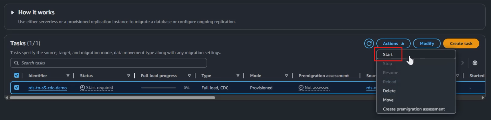
3. En unos minutos, verás que el estado de la migración será "Load completed, replication ongoing".
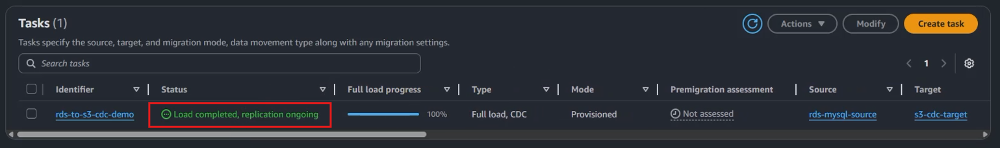
4. Al entrar en la tarea y dirigirte a Table statistics, deberás tener un registro con el estado "Table completed".
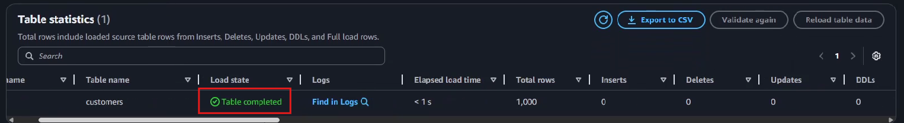
5. Si deseas ver la información cargada como archivo `parquet`, puedes dirigirte al bucket de `dms-cdc-demo-<código>` en el servicio de S3 e ingresar a las carpetas hasta ver un archivo con un nombre llamado `LOAD00001.parquet` o similar.  
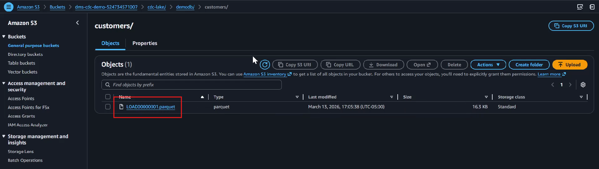

### Ver la información en Athena
1. Para reconocer la estructura de la información consumida, se tiene que usar Glue Catalog. Para ello, busca el servicio de Glue y dirígete a la sección Crawler.
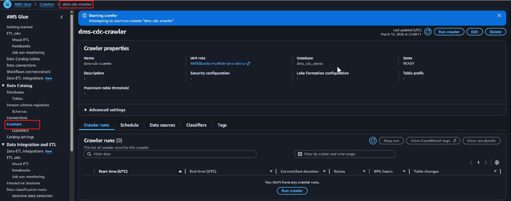
2. Ejecuta el Crawler de Glue. Esto tomará unos minutos hasta completarse.
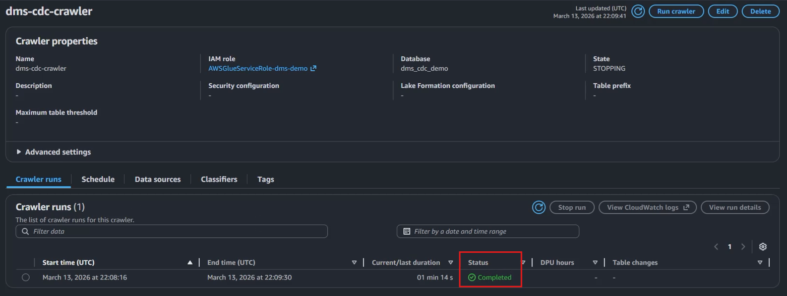
3. Una vez completado el Crawler, busca el servicio de Athena, selecciona la base de datos creada e ingresa el siguiente query para validar la información:
```sql
SELECT * FROM "dms_cdc_demo"."cdc_lake" LIMIT 1000;
```
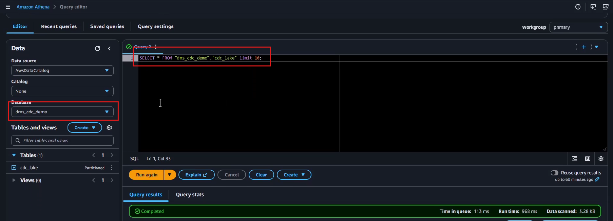

### Probar el patrón CDC
1. En `src/scripts/`, vuelve a ejecutar el script de Python y selecciona la opción `2`. Ahí se le indicará la funcionalidad de realizar cargas incrementales de las modificaciones a la tabla creada. Puede indicar la cantidad de minutos para que esté ejecutándose.
2. Si se dirige a DMS y la tarea creada, notará que los registros dentro de Table statistics han variado comparado a la última vez. De esa manera valida que se aplicaron las modificaciones.
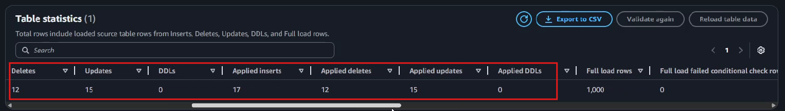
3. Si se dirige al bucket de S3, notará que hay una nueva carpeta en el que se almacenan nuevos archivos `parquet` que registran todas las modificaciones.
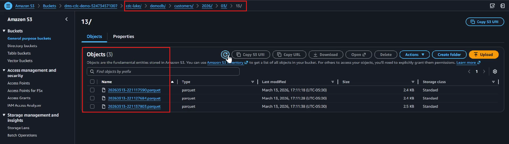
4. Si se dirige a Athenta, notará que al momento de ejecutar la query hay nuevos registros que son los cambios aplicados.
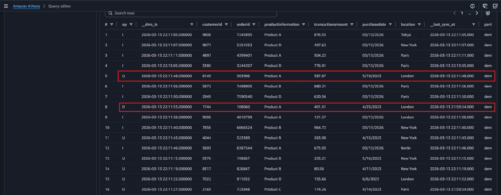

¡Felicidades! Has logrado implementar una arquitectura con el patrón CDC. 🥳

## Menciones
- Hossain, Y. (2024). Customer Transactions Dataset. Kaggle. https://www.kaggle.com/datasets/yaminh/customer-transactions-dataset?select=customer_data.csv

<hr/>
<p align="center">Hecho con 💙 por Robert Charca.</p>